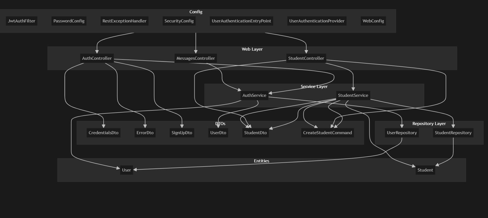

# Student Management System

This project is a **CRUD-based Student Management System** that implements **JWT authentication**, built using **React** for the frontend and **Spring Boot** for the backend. It includes **Flyway** for database migrations and uses **Docker Compose** to run a PostgreSQL database.

## ✨ Features

- Create, Read, Update, and Delete student records
- JWT-based user authentication
- Flyway-based database versioning and migrations
- React-based responsive UI
- PostgreSQL database setup using Docker Compose

## 🛠️ Tech Stack

- **Frontend:** React
- **Backend:** Spring Boot (Java 17)
- **Authentication:** JWT
- **Database:** PostgreSQL
- **Migration:** Flyway
- **Containerization:** Docker Compose

---

## 🚀 Getting Started

### Prerequisites

- Java 17
- Docker & Docker Compose
- Node.js & npm (for running the React app)

### 1. Run the Database

```bash
This will:

### ✅ Start a PostgreSQL database container

- Expose it on port `5434`
- You can access the database using a DB UI (like **pgAdmin**) at [http://localhost:5050](http://localhost:5050)
- Or manually connect to `localhost:5434` and create a database named `HahnStudents`


## 🗂️ Architecture

The architecture of the app is like this:



